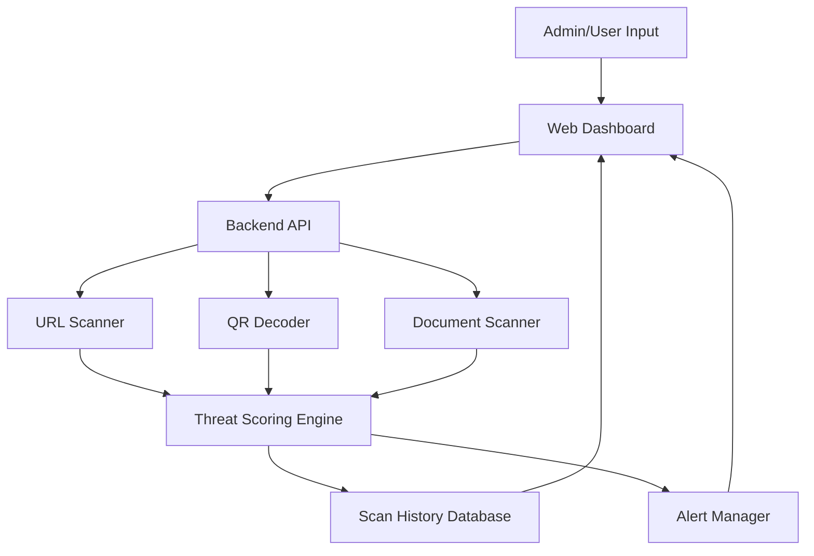

# Architecture

## Proposed Solution Form

The recommended starting point is a standalone web application with a backend scanning engine. This is the safest first version because it is easy to demo, does not depend on access to an internal Harvio product, and can later be exposed as an API or integrated into another platform.

## Main Components

1. Frontend dashboard
2. Backend API
3. URL scanner
4. QR decoder and scanner
5. Document scanner
6. Threat scoring engine
7. Scan history storage
8. Alert module

## High-Level Flow

1. User submits a URL, QR image, or document through the dashboard.
2. Backend identifies the input type and sends it to the relevant scanner.
3. Scanner extracts threat indicators.
4. Threat scoring engine assigns a severity level.
5. Result is stored in history.
6. Dashboard shows the result and alert reason.

## Draft Architecture Diagram

## Suggested Technology Direction

- Frontend: React
- Backend: FastAPI or Flask
- Database: SQLite
- Alerts: dashboard first, email later if time permits

## MVP Scope Boundary

The first version should focus on demonstrable detection and alerting. It should not attempt to become a full antivirus engine, enterprise SIEM, or browser extension unless Harvio explicitly requests that format.
